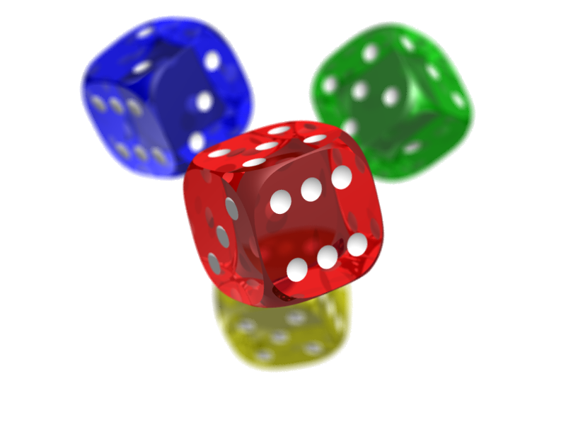

HCImage - Yet Another PHP Image library
=======

## Specifics:
- OOP wrapper for gd extension
- easy to use
- fluent interface
- serializable
- documented
- fast, internally try to be as fast as possible (where needed eg per pixel operations)
- by default add/save transparency so can be memory hungry

## Example

### Input image

### Code

<pre lang="php"><code>
include dirname(__DIR__) . '/HCImage.class.php';
use HC\Image;
try {
    $img  = Image::load('img/PNG_transparency_demonstration_1.png');
    $time = microtime(true);
    
    $img2 = clone $img->trim();
    $img->getCanvas()
            ->getFilter()
            ->grayScale()
            ->negate()
            ->colorize(2, 118, 219)
            ->negate()
            ->brightness(30)
            ->contrast(-30);

    $img2->crop(0, 0, $img->getWidth() * 2, $img->getHeight())
         ->merge($img, $img->getWidth(), 0)
         ->save('out/filtered', 'png', 9);
} catch (Exception $exc) {
    echo $exc->getMessage(), PHP_EOL;
</code></pre>

### Output

## TODO

- prepare for composer
- add more helpers eg. Effects, Gradients
- add more examples
- add maybe some unit tests ?
- maybe generate docs

